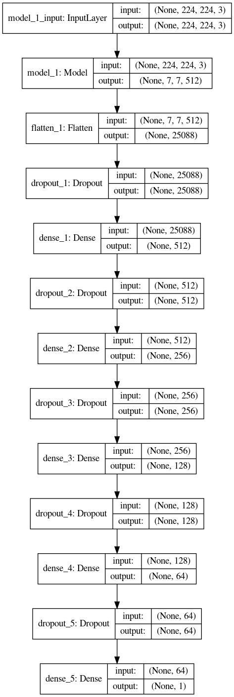

# FDA  Submission

**Your Name:**

**Name of your Device:**

## Algorithm Description 

### 1. General Information

**Intended Use Statement:** 

For assisting the radiologist in the detection of pneumonia in a chest X-ray image.

**Indications for Use:**

Screening chest X-ray studies taken in PA or AP positions from any human subject between ages 2-90 years old. The human may present or not any other chest condition detectable by X-ray.

**Device Limitations:**

The algorithm is best adapted for subjects between 20-70 years old.

**Clinical Impact of Performance:**

The algotihm was trained in a huge dataset where only 1.28% of the images corresponded to patients with pneumonia. Then it is designed to have a high number of false positives in order to minimize false negatives.

### 2. Algorithm Design and Function

**DICOM Checking Steps:**

**Preprocessing Steps:**

**CNN Architecture:**

### 3. Algorithm Training

**Parameters:**
* Types of augmentation used during training
* Batch size
* Optimizer learning rate
* Layers of pre-existing architecture that were frozen
* Layers of pre-existing architecture that were fine-tuned
* Layers added to pre-existing architecture

<< Insert algorithm training performance visualization >> 

<< Insert P-R curve >>

**Final Threshold and Explanation:**

### 4. Databases
 (For the below, include visualizations as they are useful and relevant)

**Description of Training Dataset:** 

**Description of Validation Dataset:** 

### 5. Ground Truth

### 6. FDA Validation Plan

**Patient Population Description for FDA Validation Dataset:**

**Ground Truth Acquisition Methodology:**

**Algorithm Performance Standard:**
