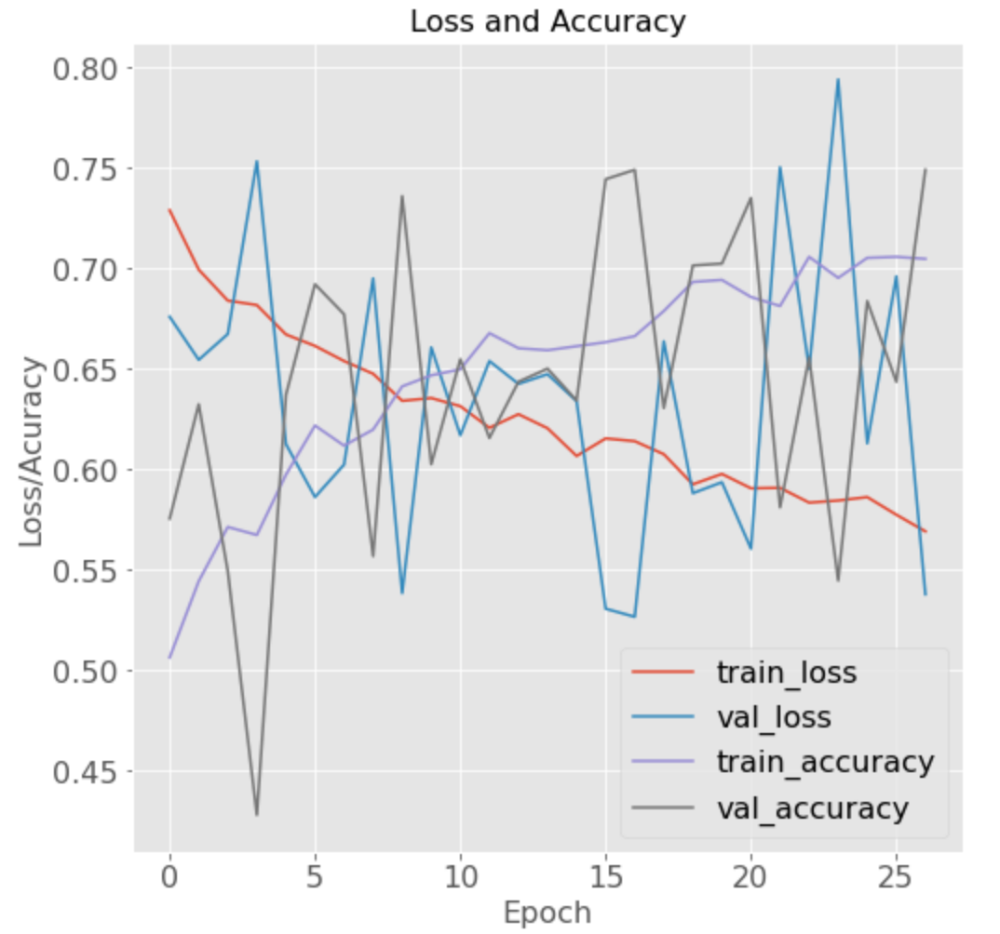
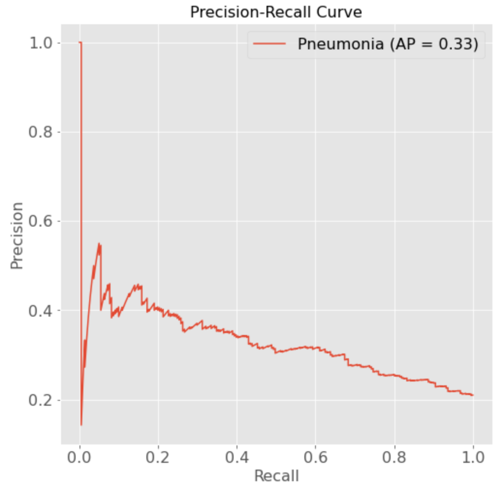

# FDA  Submission

**Your Name:**

**Name of your Device:**

## Algorithm Description 

### 1. General Information

**Intended Use Statement:** 

For assisting the radiologist in the detection of pneumonia in a chest X-ray image.

**Indications for Use:**

Screening chest X-ray studies taken in PA or AP positions from any human subject between ages 2-90 years old. The subject may present or not any other chest condition detectable by X-ray.

**Device Limitations:**

The algorithm is best adapted for subjects between 20-70 years old.
The algorithm has a very low sensitivity and thus performs very poorly in the presence of atelectasis, cardiomegaly, emphysema.
In the presence of other diseases, due to the high specificity in that condition, the algorithm has a better use if employed mainly to dismiss pneumonia.

**Clinical Impact of Performance:**

The algorithm was trained in a huge dataset where only 1.28% of the images corresponded to patients with pneumonia and trained for a clinical setting where pneumonia is prevalent in 20% of cases. Under this condition, recall is a wel adapted metric because it will favor a high number of false positives in order to minimize false negatives, and thus a negative impact on the patient. However, this model is designed to assist a radiologist in diagnosis, so the best F1 score will be considered to evaluate performance. 

### 2. Algorithm Design and Function

Model plot: "model_1: Model" corresponds to a pretrained VGG16 architecture.

**DICOM Checking Steps:**

Check for imaging modality: X-ray ('DX').
Check for imaged body part: 'CHEST'.
Check for patient position: posterior/anterior ('PA') or anterior/posterior ('AP').
Check patien's age: between 2 and 90 years old.
Images checked to be gray images, if not turned to gray.

**Preprocessing Steps:**

If images are RGB, changed to gray.
Images scaled bewteen 0 and 255 (divided by 255).

**CNN Architecture:**

CNN architecture VGG16 pretrained model.
VGG16 architecture up to pooling of 3rd convolutional layer from block 5.

### 3. Algorithm Training

**Parameters:**
* Types of augmentation used during training:
  - Horizontal_flip.
  - Vertical_flip.
  - Height shift between 0 and 0.1.
  - Width shift between 0 and 0.1.
  - Rotation between 0° and 20°.
  - Shear between 0 and 0.1.
  - Zoom between 0 and 0.1

* Batch size:
  - Training: 16.
  - Validation: 6037.

* Optimizer learning rate: 0.0001.
* Layers of pre-existing architecture that were frozen:
first 16 layers.

* Layers of pre-existing architecture that were fine-tuned: 17 and 18 (see image above).
* Layers added to pre-existing architecture: 11 layers added (image below).

Model_1 below corresponds to pretrained VGG16 architecture.

* Training performance visualization:

 * P-R curve:

 * F₁ score vs. threshold:

**Final Threshold and Explanation:**

The metric of choice ti choose the threshold was the F₁ score. As the plot above shows, the best score is obtained for a threshold of \~0.34. Under the chosen threshold, the algorithm gives the following during validation:  
- Accuracy: \~0.65  
- Precision: \~0.32  
- Recall: \~0.61  
- F₁ Score: \~0.42

### 4. Databases
 (For the below, include visualizations as they are useful and relevant)

 The training and validation datasets are comprised of chest X-rays ('DX') images for female and male patients bewteen 2 and 90 years old. The X-ray images have either an anterior/posterior or a posterior/anterior view. Finally the most common co-occurrences with pneumonia are infiltration, edema, atelectasis and effusion. Only in 22.5% of cases where there is a finding in an image, pneumonia is found alone.

**Description of Training Dataset:** 

  - Data with no pneumonia: 50%.
  - Data with pneumonia: 50%.
  - Number of training images: 2288.
  - Number of validating images: 1073.

**Description of Validation Dataset:** 

  - Data with no pneumonia (as in original dataset): 80%.
  - Data with pneumonia (as in original dataset): 20%.
  - Number of validation images (different from training validation images): 1072.

### 5. Ground Truth

Data curated by NIH. Ground truth labels extracted using Natural Language Processing (NLP). This is one of its biggest limitations but the NLP accuracy labeling was estimated to be better than 90%.

The second biggest limitation is the low amount of pneumonia images in the dataset but this was taken into account for training and model results interpretation.

### 6. FDA Validation Plan

**Patient Population Description for FDA Validation Dataset:**

  - Human subjects between 20-70 years old.
  - Chest X-ray studies taken in PA or AP positions.
  - Most common co-occorrences to avoid: edema, infiltration, atelectasis and effusion.

**Ground Truth Acquisition Methodology:**

The algorithm will be used as an aid tool for a radiologist's diagnosis. As such, the silver standard measure is used to evaluate the algorithm. In this particular case, the silver standard is the labelling from experienced radiologists.

**Algorithm Performance Standard:**

According to [Rajpurkar et al. [1]](https://arxiv.org/pdf/1711.05225.pdf) to evaluate the algorithm performance F₁ scores of the algorithm predictions are compared to scores from 4 different radiologists.  A final F₁ score greater than the average from radiologists' scores is acceptable. In this case, an F₁ > 0.387 stands for a good model.

**References:**

[1] Pranav Rajpurkar, Jeremy Irvin, Kaylie Zhu, Brandon Yang, Hershel Mehta, Tony Duan, Daisy Ding, Aarti Bagul, Curtis Langlotz, Katie Shpanskaya, Matthew P. Lungren, Andrew Y. Ng,
    *"CheXNet: Radiologist-Level Pneumonia Detection on Chest X-Rays with Deep Learning"*, 2017, [https://arxiv.org/pdf/1711.05225.pdf](https://arxiv.org/pdf/1711.05225.pdf)